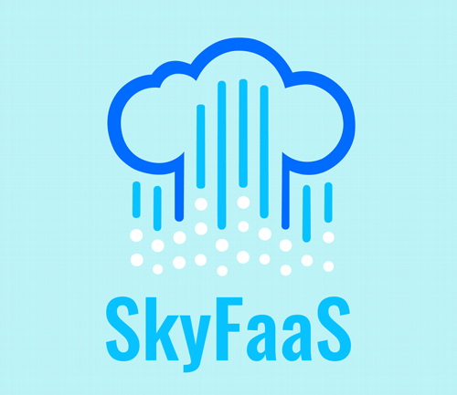

# SkyFaaS ® - Serverless platform made with Node.js

---

SkyFaaS is a cloud-native, Function-as-a-Service (FaaS) platform written in Node.js and TypeScript, designed to run
serverless functions at scale.

**Note: While JavaScript and Node.js are not traditionally considered the most optimal choice for serverless platforms
due to factors like cold start performance, we believe in exploring different technologies and pushing boundaries.
SkyFaaS is our take on building a FaaS platform using these tools, and we’re excited to see how it performs in
real-world scenarios.    
In a simple word, we want to try it :)**

